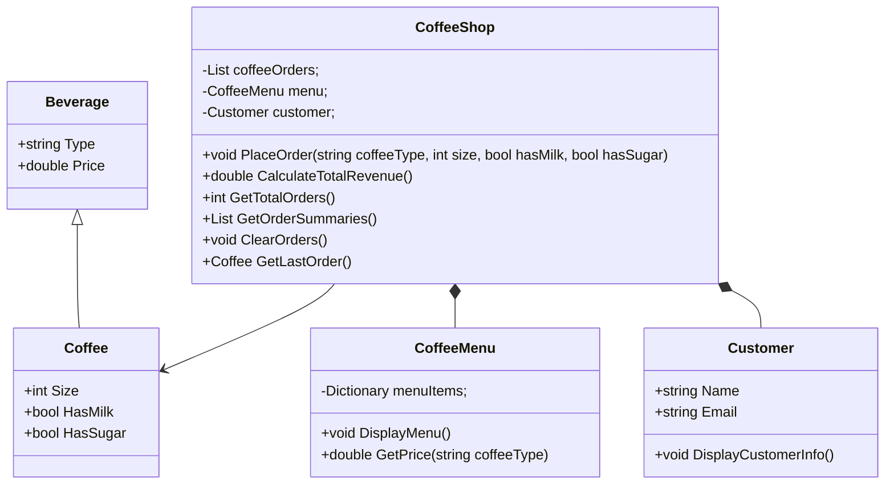

```mermaid
classDiagram
class Beverage{
+string Type
+double Price
}
class Coffee{
+int Size
+bool HasMilk
+bool HasSugar
 }
class Customer{
+string Name
+string Email
+void DisplayCustomerInfo()
}
class CoffeeMenu{
-Dictionary<string, Beverage> menuItems;
+void DisplayMenu()
+double GetPrice(string coffeeType)
}
class CoffeeShop{
-List<Coffee> coffeeOrders;
-CoffeeMenu menu;
-Customer customer;
+void PlaceOrder(string coffeeType, int size, bool hasMilk, bool hasSugar)
+double CalculateTotalRevenue()
+int GetTotalOrders()
+List<string> GetOrderSummaries()
+void ClearOrders()
+Coffee GetLastOrder()
}
Beverage<|--Coffee
CoffeeShop*--CoffeeMenu
CoffeeShop*--Customer
CoffeeShop-->Coffee
```
